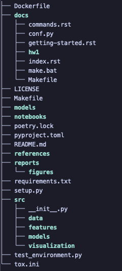
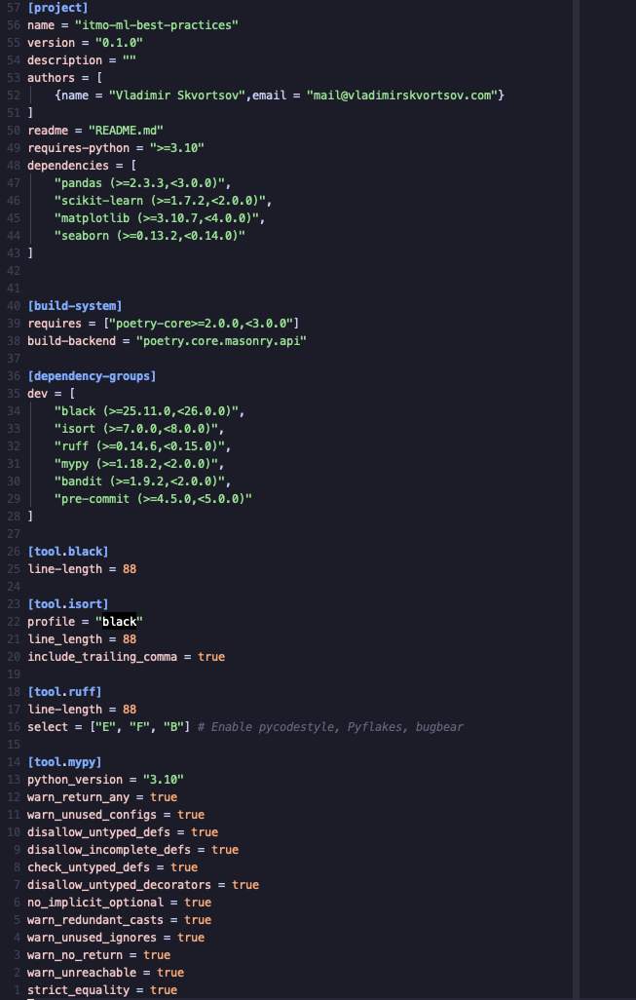
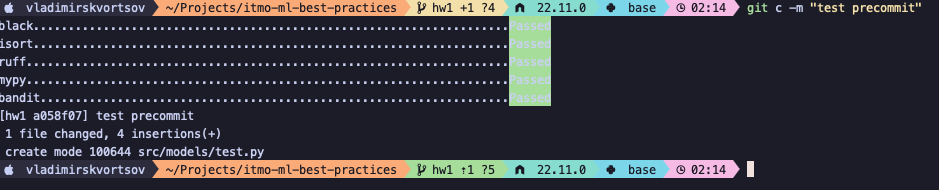
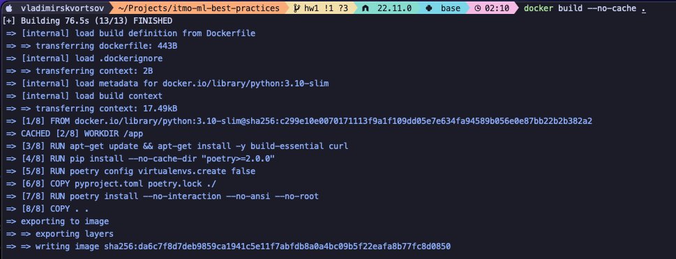

# Отчет о настройке рабочего места для Data Science

## 1. Структура проекта

Для создания стандартизированной структуры проекта был использован инструмент **Cookiecutter** с шаблоном `cookiecutter-data-science` (v1).

**Результат:**
Структура папок проекта выглядит следующим образом:

## 2. Управление зависимостями

В качестве пакетного менеджера выбран **Poetry**. Он позволяет жестко фиксировать версии библиотек в `poetry.lock` и автоматически управляет виртуальным окружением.

- Создан файл `pyproject.toml` с конфигурацией проекта.
- Разделены зависимости на основные (`dependencies`) и для разработки (`group.dev`).

**Конфигурация:**

## 3. Качество кода и pre-commit hooks

Настроена автоматическая проверка качества кода с использованием **pre-commit**. При каждой попытке коммита запускаются следующие хуки:

- **Black**: автоформатирование кода.
- **Isort**: сортировка импортов.
- **Ruff**: быстрый линтер для поиска ошибок.
- **MyPy**: проверка статической типизации.
- **Bandit**: проверка на уязвимости безопасности.

Конфигурации инструментов прописаны в `pyproject.toml`, чтобы избежать конфликтов между ними.

**Демонстрация работы:**
Ниже показан процесс коммита, где pre-commit автоматически проверяет файлы:

## 4. Контейнеризация (Docker)

Для обеспечения воспроизводимости среды на любой машине создан `Dockerfile`.

- Используется базовый образ `python:3.10-slim`.
- Зависимости устанавливаются через `poetry` без создания виртуального окружения внутри контейнера (для уменьшения размера образа).

**Сборка образа:**

## 5. Git Workflow

- Инициализирован Git-репозиторий.
- Настроен файл `.gitignore` (исключены `.venv`, `data/`, `.DS_Store` и другие временные файлы).
- Работа организована по веткам: `main` (стабильная версия) и `develop` (для разработки).

---

**Автор:** Скворцов Владимир
**Дата:** 24.11.2025
