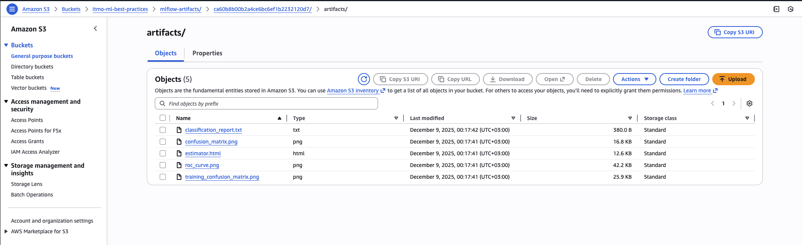

# Отчет по домашней работе №2

## 1. Версионирование данных через Git LFS

### Установка и настройка

Git LFS заменяет большие файлы на указатели в репозитории, а сами файлы хранит в S3.

**Файл `.gitattributes`:**

```
*.csv filter=lfs diff=lfs merge=lfs -text
*.pkl filter=lfs diff=lfs merge=lfs -text
*.h5 filter=lfs diff=lfs merge=lfs -text
data/** filter=lfs diff=lfs merge=lfs -text
```

**Файл `.lfsconfig`:**

```ini
[lfs]
    url = s3://itmo-ml-best-practices/lfs-objects?region=us-east-1
```

---

## 2. Версионирование моделей через MLflow

### Архитектура

Система состоит из нескольких компонентов:

- Training Script логирует параметры, метрики и артефакты
- MLflow Server хранит метаданные в PostgreSQL
- Артефакты (модели, графики) сохраняются в S3

### Основные модули

**`src/models/train_model.py`** - скрипт обучения
**`src/models/predict_model.py`** - скрипт оценки
**`src/models/compare_models.py`** - скрипт сравнения моделей

### Метаданные

При каждом запуске логируются:

- `Parameters`: гиперпараметры модели, путь к данным
- `Metrics`: accuracy, precision, recall, f1, roc_auc
- `Artifacts`: сериализованная модель, confusion matrix, ROC curve
- `Tags`: тип модели, название run

### Сравнение моделей

Скрипт `compare_models.py` позволяет сравнивать эксперименты:

```bash
python src/models/compare_models.py --max-runs 10
```

Результат выводится в виде таблицы с метриками. Можно найти лучшую модель по конкретной метрике или сравнить версии зарегистрированной модели.

### Model Registry

Модели можно регистрировать и управлять их жизненным циклом:

```bash
# Регистрация
python src/models/train_model.py --register-model "iris-classifier"

# Использование в продакшене
python src/models/predict_model.py \
    --model-name "iris-classifier" \
    --stage Production
```

Стадии: Development → Staging → Production → Archived

### S3 артефакты



---

## 3. Воспроизводимость

### Фиксация зависимостей

Все версии библиотек зафиксированы в `poetry.lock`. При установке через `poetry install` используются точные версии из lock-файла.

### Docker

**Dockerfile** теперь включает Git LFS и все зависимости проекта:

**docker-compose.yml** поднимает необходимую инфраструктуру:

```yaml
services:
  mlflow-server: # Tracking server
  postgres: # Metadata storage
  ml-app: # Приложение
```

Для запуска достаточно:

```bash
docker-compose up -d
docker-compose exec ml-app bash
```

### Тест воспроизводимости

Скрипт `test_reproducibility.sh` обучает модель дважды с одинаковыми параметрами и сравнивает метрики. При правильной настройке random seed результаты идентичны.

```bash
make test-reproducibility
```

### Makefile

Добавлены команды для удобства:

```makefile
train:                # Обучение
compare:              # Сравнение моделей
mlflow-ui:            # Запуск UI
docker-up:            # Запуск инфраструктуры
test-reproducibility: # Тест
```

### Пример использования

```bash
# Запуск инфраструктуры
docker-compose up -d

# Обучение модели
make train

# Сравнение экспериментов
make compare

# Просмотр в MLflow UI: http://localhost:3000
```
