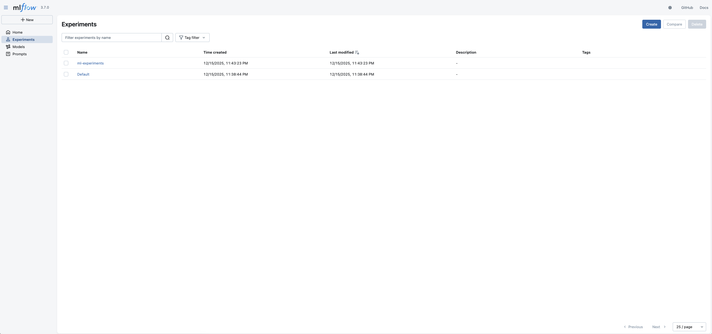
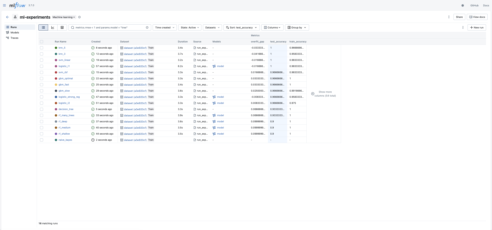

# Отчет по домашней работе №3

## 1. Настройка MLflow

### Установка и базовая конфигурация

MLflow уже был настроен в рамках ДЗ2. Текущая конфигурация включает:

- MLflow tracking server с PostgreSQL backend
- AWS S3 для хранения артефактов
- Docker Compose для локального развертывания
- Autologging для автоматического трекинга

### Docker Compose

Инфраструктура запускается одной командой:

```bash
docker-compose up -d
```

Компоненты:

- `mlflow-server` - tracking server на порту 3000
- `postgres` - хранение метаданных экспериментов
- `ml-app` - контейнер для запуска экспериментов

### Аутентификация

Для production среды в docker-compose.yml предусмотрены переменные окружения для AWS credentials:

```yaml
environment:
  - AWS_ACCESS_KEY_ID=${AWS_ACCESS_KEY_ID}
  - AWS_SECRET_ACCESS_KEY=${AWS_SECRET_ACCESS_KEY}
```

Доступ к MLflow UI осуществляется через http://localhost:3000



---

## 2. Проведение экспериментов

### Скрипт для массового запуска

Создан `src/experiments/run_experiments.py` для автоматического запуска 17 экспериментов с разными алгоритмами:

**Протестированные алгоритмы:**

- Logistic Regression (3 варианта с разной регуляризацией)
- Random Forest (4 варианта с разной глубиной)
- Gradient Boosting (3 варианта с разным learning rate)
- SVM (2 варианта: linear и RBF)
- K-Nearest Neighbors (2 варианта)
- Decision Tree
- Naive Bayes
- AdaBoost

### Запуск экспериментов

```bash
# Через Makefile
make experiments

# Или напрямую
python src/experiments/run_experiments.py
```

### Логирование

Благодаря `mlflow.sklearn.autolog()` автоматически логируются:

- Все гиперпараметры модели
- Метрики обучения (accuracy, precision, recall, f1)
- Сериализованная модель
- Training score

Дополнительно логируются кастомные метрики:

- `train_accuracy` - точность на обучающей выборке
- `test_accuracy` - точность на тестовой выборке
- `overfit_gap` - разница между train и test accuracy

### Система сравнения

Создан CLI-инструмент `search_runs.py` с командами:

```bash
# Поиск с фильтрами
python src/experiments/search_runs.py search \
    --filter "metrics.test_accuracy > 0.9" \
    --order-by "metrics.test_accuracy DESC"

# Лучшая модель по метрике
python src/experiments/search_runs.py best --metric test_accuracy

# Таблица лидеров
python src/experiments/search_runs.py leaderboard --metric test_accuracy --top 10

# Детальная информация о run
python src/experiments/search_runs.py show <run_id>

# Экспорт в CSV
python src/experiments/search_runs.py export
```

### Фильтрация и поиск

MLflow поддерживает мощный DSL для фильтрации:

```python
# Примеры фильтров
"metrics.accuracy > 0.9"
"params.model_type = 'random_forest'"
"metrics.test_accuracy > 0.9 AND params.max_depth < 15"
"tags.algorithm = 'gradient_boosting'"
```

Реализована функция `search_experiments()` в `utils.py`:

```python
from src.experiments.utils import search_experiments

runs = search_experiments(
    "ml-experiments",
    filter_string="metrics.test_accuracy > 0.95",
    order_by=["metrics.test_accuracy DESC"],
    max_results=10
)
```

---

## 3. Интеграция с кодом

### Декораторы

Создан модуль `src/experiments/decorators.py` с декораторами для автоматизации:

**@mlflow_experiment** - оборачивает функцию в MLflow run:

```python
@mlflow_experiment("my-experiment", "my-run")
def train_model(data, params):
    model = fit(data, params)
    return model
```

**@log_params** - автоматически логирует параметры функции:

```python
@log_params
def train_model(learning_rate=0.01, n_estimators=100):
    # parameters будут залогированы автоматически
    pass
```

**@log_metrics** - автоматически логирует возвращаемые метрики:

```python
@log_metrics(["accuracy", "f1_score"])
def evaluate(model, X, y):
    return {"accuracy": 0.95, "f1_score": 0.93}
```

**@log_execution_time** - логирует время выполнения:

```python
@log_execution_time
def train_model():
    # execution time будет залогировано
    pass
```

### Контекстный менеджер

Класс `MLflowContext` для удобной работы с runs:

```python
from src.experiments.decorators import MLflowContext

with MLflowContext("experiment-name", "run-name") as mlf:
    mlf.log_param("lr", 0.01)
    model.fit(X, y)
    mlf.log_metric("accuracy", 0.95)
```

Преимущества:

- Автоматическое открытие и закрытие run
- Обработка ошибок (логирует exception в случае падения)
- Установка тега status (success/failed)

### Утилиты

Модуль `src/experiments/utils.py` содержит helper-функции:

**search_experiments()** - поиск и фильтрация runs:

```python
runs = search_experiments(
    "ml-experiments",
    filter_string="metrics.accuracy > 0.9"
)
```

**compare_runs()** - сравнение конкретных runs:

```python
comparison = compare_runs(
    "ml-experiments",
    run_ids=["abc123", "def456"],
    metric_cols=["accuracy", "f1"],
    param_cols=["learning_rate", "n_estimators"]
)
```

**get_best_run()** - поиск лучшего run:

```python
best = get_best_run("ml-experiments", "accuracy")
```

**print_run_summary()** - вывод детальной информации:

```python
print_run_summary(run_id)
```

**export_experiments()** - экспорт в CSV:

```python
export_experiments("ml-experiments", "results.csv")
```

---

## 4. Результаты экспериментов

После запуска `make experiments` получены следующие результаты:



### Top-5 моделей по test accuracy

1. **knn_5** - Test: 1
2. **knn_3** - Test: 1
3. **svm_linear** - Test: 1
4. **logistic_l1** - Test: 1
5. **naive_bayes** - Test: 0.9667

---

## 5. Использование

### Базовый workflow

```bash
# 1. Запустить инфраструктуру
docker-compose up -d

# 2. Запустить эксперименты
make experiments

# 3. Просмотреть результаты
make leaderboard

# 4. Открыть MLflow UI
make mlflow-ui
# http://localhost:3000
```

### Makefile команды

```bash
make train          # Обучить одну модель
make experiments    # Запустить 17 экспериментов
make search         # Поиск runs
make leaderboard    # Таблица лидеров
make mlflow-ui      # Открыть UI
```
