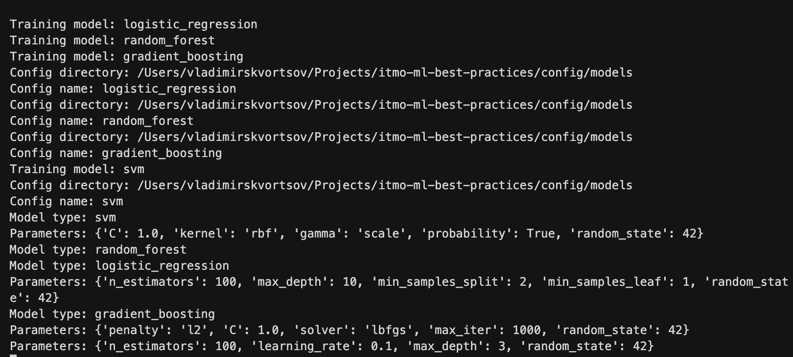
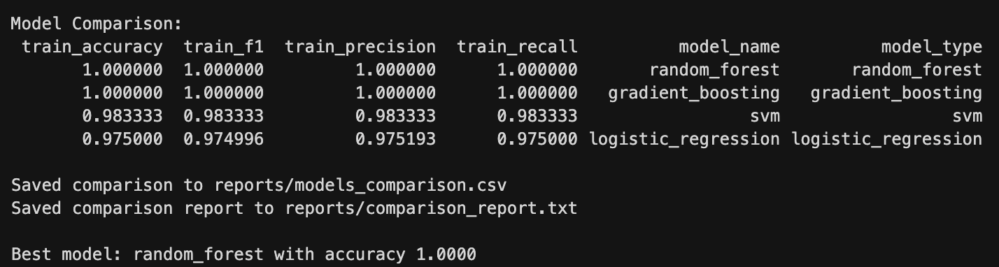
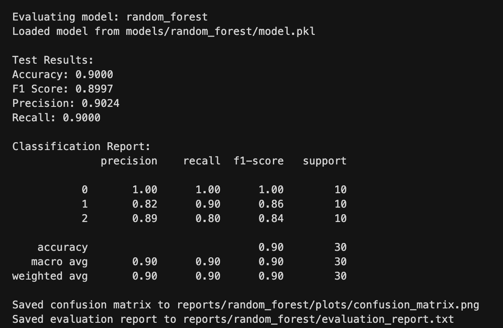

# Отчет по домашней работе №4

## 1. Настройка Snakemake

### Workflow для ML-пайплайна

Создан `Snakefile` с полным ML-пайплайном:

**Этапы пайплайна:**

1. **prepare_data** - Подготовка и разделение данных

   - Input: `data/raw/iris.csv`
   - Output: `train.csv`, `test.csv`, `metadata.json`
   - Параметры: test_size, random_state, target_col

2. **train_model** - Обучение модели с Hydra

   - Input: train данные + metadata
   - Output: модель (pkl) + метрики (json)
   - Конфигурация загружается из `config/models/{model}.yaml`

3. **evaluate_model** - Оценка модели

   - Input: test данные + модель
   - Output: отчет + confusion matrix
   - Создает визуализации результатов

4. **compare_models** - Сравнение всех моделей
   - Input: метрики всех моделей
   - Output: сводный отчет + CSV с рейтингом

### Зависимости между этапами

Зависимости DAG:

```
prepare_data -> train_model (×4 параллельно) -> evaluate_model (×4 параллельно) -> compare_models
```

### Кэширование и параллелизм

**Кэширование:**

- Snakemake автоматически кэширует результаты
- Пересчитывает только измененные этапы
- Проверка по временным меткам файлов

**Параллельное выполнение:**

```python
resources:
    mem_mb = 2000,
    cpus = 2
```

Запуск с параллельными задачами:

```bash
snakemake --cores all
```

**Демонстрация параллельного выполнения:**



На скриншоте видно, что 4 модели (logistic_regression, random_forest, gradient_boosting, svm) обучаются параллельно после этапа prepare_data.

---

## 2. Настройка Hydra

### Структура конфигураций

```
config/
├── pipeline_config.yaml       # Главная конфигурация
└── models/
    ├── logistic_regression.yaml
    ├── random_forest.yaml
    ├── gradient_boosting.yaml
    └── svm.yaml
```

### Конфигурации моделей

**Пример: Random Forest**

```yaml
model:
  name: "RandomForest"
  type: "random_forest"

parameters:
  n_estimators: 100
  max_depth: 10
  min_samples_split: 2
  min_samples_leaf: 1
  random_state: 42

training:
  cross_validation: true
  cv_folds: 5

mlflow:
  log_model: true
  register_model: true
  model_name: "random_forest_iris"
```

### Валидация конфигураций

Hydra автоматически валидирует:

- Типы параметров
- Обязательные поля
- Структуру YAML

### Композиция конфигураций

Используется Hydra API для программной загрузки конфигураций:

```python
from hydra import compose, initialize_config_dir
from hydra.core.global_hydra import GlobalHydra

# Очистка предыдущих инстансов Hydra
GlobalHydra.instance().clear()

# Инициализация с директорией конфигураций
config_dir = str(Path.cwd() / "config" / "models")

with initialize_config_dir(version_base=None, config_dir=config_dir):
    # Загрузка конфигурации по имени модели
    cfg = compose(config_name="random_forest")

    # Доступ к параметрам
    model_type = cfg.model.type
    params = dict(cfg.parameters)
```

---

## 3. Интеграция и тестирование

### Интеграция Snakemake + Hydra

Скрипт `scripts/train_with_hydra.py` объединяет оба инструмента.

Snakemake передает `model_name` через `params`, Hydra загружает соответствующий YAML файл.

### Мониторинг выполнения

Создан скрипт `scripts/monitor_pipeline.py`:

- Анализ лог-файлов
- Проверка выходных файлов
- Сводка по всем моделям
- Визуальные индикаторы статуса

### Уведомления

Реализованы через `send_notification()`:

- Успешное завершение
- Ошибки выполнения
- Предупреждения

### Воспроизводимость

1. **Фиксированные random_state**

   ```yaml
   random_state: 42
   ```

2. **Детерминированный порядок выполнения**

   - DAG определяет последовательность
   - Кэширование промежуточных результатов

3. **Контейнеризация через Docker**

Проверка воспроизводимости:

```bash
# Первый запуск
make pipeline

# Очистка
make pipeline-clean

# Повторный запуск - те же результаты
make pipeline
```

Файл: `models_comparison.csv`





---

## 4. Использование

### Makefile команды

```bash
# Запуск полного пайплайна
make pipeline

# Dry run (показать план)
make pipeline-dry

# Очистка результатов
make pipeline-clean

# Визуализация workflow
make pipeline-viz

# Мониторинг выполнения
make pipeline-monitor

# Запуск + автоматический мониторинг
make pipeline-run
```

### Добавление новой модели

1. Создать конфигурацию `config/models/new_model.yaml`
2. Добавить в `config/pipeline_config.yaml`:
   ```yaml
   models:
     - new_model
   ```
3. Запустить пайплайн:
   ```bash
   make pipeline
   ```
