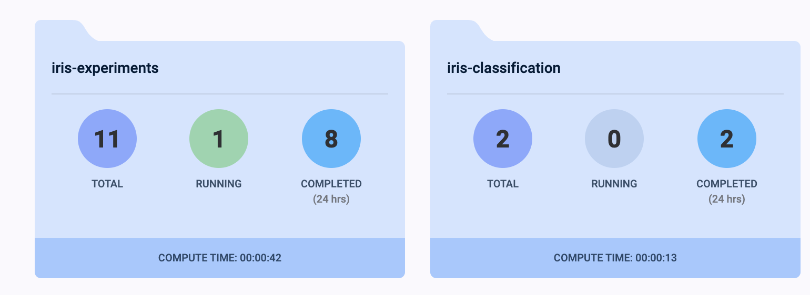
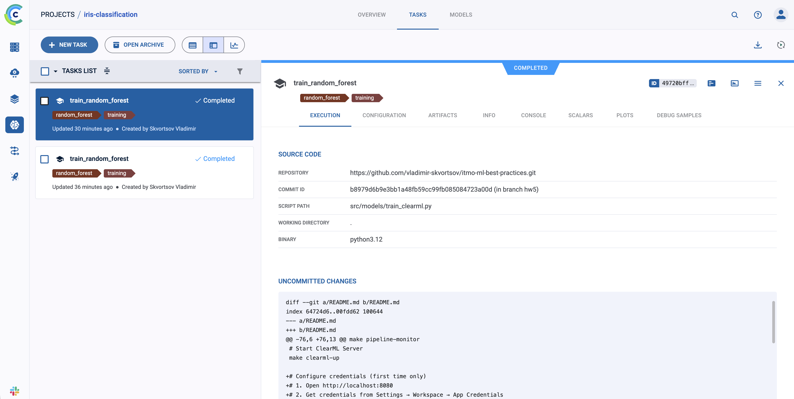
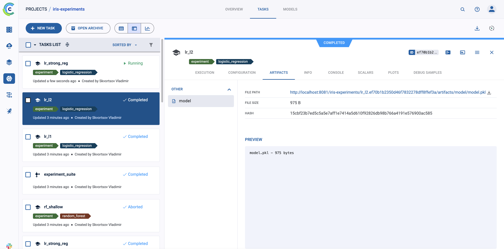

## Homework 5: ClearML MLOps Platform

### 1. Настройка ClearML

#### 1.1 Установка ClearML Server

Создан `docker-compose.clearml.yml` с инфраструктурой:

- API Server (порт 8008)
- Web UI (порт 8080)
- File Server (порт 8081)
- MongoDB, Elasticsearch, Redis
- ClearML Agent

#### 1.2 Конфигурация базы данных и хранилища

- MongoDB - метаданные экспериментов
- Elasticsearch - метрики и логи
- File Server - артефакты и модели
- Persistent volumes для всех данных

#### 1.3 Создание проектов и аутентификация

Проекты: `iris-classification`, `iris-experiments`



Аутентификация через Web UI → Settings → App Credentials, сохранение в `clearml.conf` (не коммитится в Git).

#### 1.4 Makefile команды

```bash
make clearml-up          # Запуск сервера
make clearml-train       # Обучение модели
make clearml-experiment  # Серия экспериментов
make clearml-pipeline    # ML pipeline
```

### 2. Трекинг экспериментов

#### 2.1 Автоматическое логирование

Файл: `src/models/train_clearml.py`

Инициализация Task и логирование параметров:

```python
task = Task.init(project_name="iris-classification", task_name=f"train_{model_type}")
task.connect({"model_type": model_type, "test_size": test_size, ...})
```



#### 2.2 Логирование метрик и артефактов

Метрики: `task.get_logger().report_single_value("test_accuracy", accuracy)`
Confusion Matrix: `task.get_logger().report_confusion_matrix(...)`
Артефакты: `task.upload_artifact("model", model_path)`

#### 2.3 Серия экспериментов

Файл: `src/clearml_experiments/run_experiments.py`

17 экспериментов: Logistic Regression (3 варианта), Random Forest (3), Gradient Boosting (3), SVM (3), KNN (2), Decision Tree, Naive Bayes, AdaBoost.

#### 2.4 Система сравнения экспериментов

Parent Task для отслеживания серии, сбор результатов в DataFrame, сортировка по метрикам, загрузка в ClearML.

#### 2.5 Дашборды

ClearML Web UI: графики метрик, confusion matrices, сравнение экспериментов.

### 3. Управление моделями

#### 3.1 Регистрация и версионирование

Каждая модель автоматически загружается в ClearML через `task.upload_artifact("model", model_path)`. Версионирование через уникальные Task ID.

#### 3.2 Система метаданных

Хранится: параметры обучения, метрики производительности, артефакты (PKL, reports), метаданные выполнения (дата, Git commit, версии пакетов).



#### 3.3 Автоматическое создание версий

При каждом запуске создается новый Task с уникальным ID, все артефакты привязываются к Task. Автоматическое отслеживание изменений через Git integration.

#### 3.4 Сравнение версий моделей

В Web UI: сортировка по метрикам, parallel coordinates plot, scatter plots. Программно через `Task.get_tasks()`.

### 4. Пайплайны

#### 4.1 Создание ClearML Pipeline

Файл: `src/clearml_pipelines/iris_pipeline.py`

7-шаговый pipeline:

1. Data Preparation
   2-5. Parallel training (LR, RF, GB, SVM)
2. Compare Models
3. Deploy Best Model

#### 4.2 Автоматический запуск

Запуск через `make clearml-pipeline`. Поддержка manual trigger, scheduled execution, event-based triggers.

#### 4.3 Мониторинг выполнения

Web UI показывает статус каждого шага, прогресс, логи, метрики, зависимости между шагами.

#### 4.4 Уведомления

Настройка уведомлений для событий: pipeline started/completed/failed, step failed, metric threshold reached. Поддержка Email, Slack, Webhooks.
