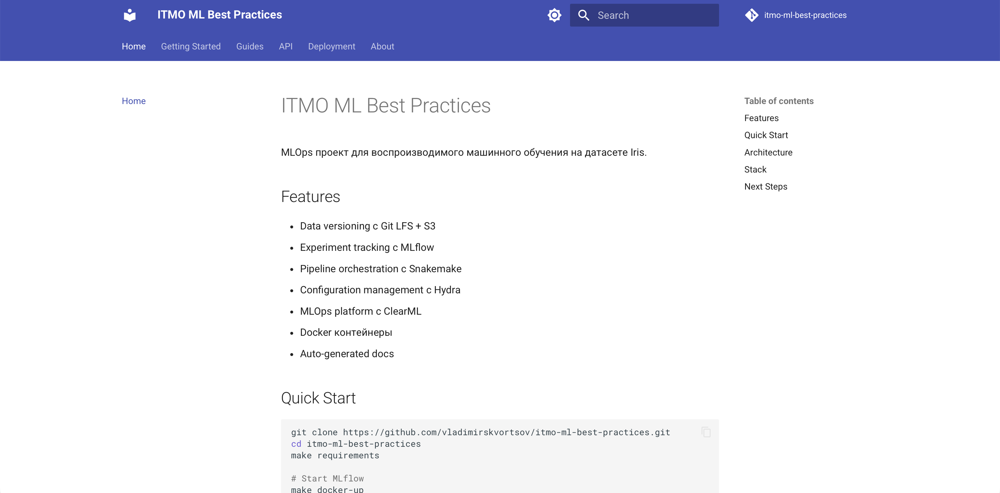
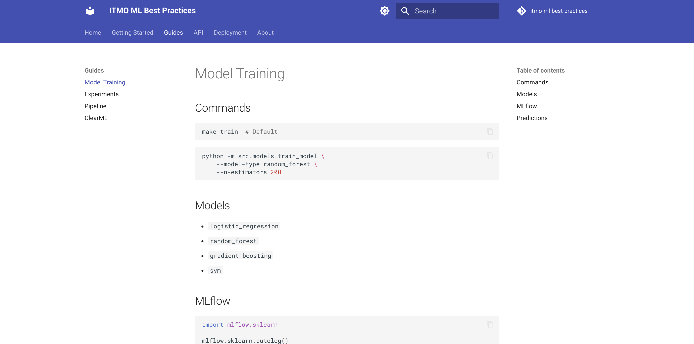

# ДЗ 6: Документация и отчеты

### MkDocs

- Material theme
- 12 страниц документации
- Автогенерация API docs
- Поиск, темная тема





### Структура

```
docs/
├── getting-started/
├── guides/
├── api/
├── deployment/
└── about/
```

### GitHub Actions

```yaml
on: push [main]
jobs: mkdocs gh-deploy --force
```

Автодеплой при push в main.

### Report Generator

`scripts/generate_experiment_report.py` - генерирует отчеты из MLflow с визуализациями.

## Команды

```bash
make docs-serve # Preview
make generate-report # Generate experiment report
```

## Результат (после пуша в master)

https://vladimirskvortsov.github.io/itmo-ml-best-practices
